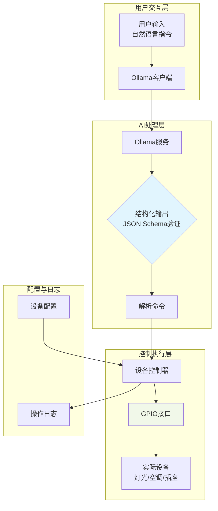

# Device Controller based on Ollama
- All in One on Raspberry 5B
- 通过Ollama大语言模型解析自然语言指令，转换为结构化设备控制命令，实现对家用设备的智能化控制。
  - **自然语言交互**：使用日常语言控制设备
  - **结构化输出**：确保AI响应符合预定格式
  - **低资源消耗**：专为树莓派等边缘设备优化
  - **模块化设计**：易于扩展新设备和控制逻辑
## 一、先决条件  
1. 系统：Raspberry Pi OS Bookworm 64-bit（32 位无法运行）。  
2. 建议 8 GB 内存版本，存储 ≥16 GB（大模型需预留 4-7 GB）。  
3. 能联网，需要sudo权限。
## 二、安装 Ollama  
```bash
# 1. 更新系统
sudo apt update && sudo apt upgrade -y

# 2. 安装依赖
sudo apt install curl git build-essential -y

# 3. 官方脚本（国内可换镜像）
curl -fsSL https://ollama.com/install.sh | sh
# 国内镜像加速（可选）
export OLLAMA_MIRROR="https://ghproxy.cn/https://github.com/ollama/ollama/releases/latest/download"
curl -fsSL https://ollama.com/install.sh | sed "s|https://ollama.com/download|$OLLAMA_MIRROR|g" | sh
```
## 三、启动ollama服务并拉取ollama模型
 ```bash
# 启动服务（通常已自动加入 systemd）
sudo systemctl enable --now ollama
# 检查 11434 端口
sudo netstat -lnpt | grep 11434

# 拉取 1.5 B 或 1 B 模型（速度/显存平衡）
ollama pull deepseek-r1:1.5b     # 推荐先玩这个
ollama pull llama3.2:1b          # 速度最快
ollama pull qwen2.5:1.5b         # 本项目使用，支持structured output   
```
## 四、系统结构

1. **用户交互层**：接收语音或文本输入
2. **AI处理层**：Ollama模型解析指令，生成结构化JSON
3. **控制执行层**：执行设备控制命令
4. **配置管理层**：设备配置和操作日志
## 五、项目机构
```text
smart_home_controller/
├── CMakeLists.txt              # 构建配置
├── build.sh                    # 一键编译脚本
├── include/                    # 头文件
│   ├── OllamaClient.h         # Ollama API客户端
│   └── DeviceController.h     # 设备控制接口
├── src/                       # 源文件
│   ├── main.cpp              # 主程序入口
│   ├── OllamaClient.cpp      # HTTP通信实现
│   └── DeviceController.cpp  # 设备控制逻辑
└── config/                    # 配置文件
    └── device_config.json    # 设备映射配置
```
## 六、部署与使用
### 环境
```bash
# 在树莓派5B上执行
# 安装系统依赖
sudo apt update
sudo apt install -y libcurl4-openssl-dev libjsoncpp-dev cmake g++

# 安装Ollama
curl -fsSL https://ollama.com/install.sh | sh

# 下载优化模型
ollama pull qwen2.5:1.5b
# 或
ollama pull phi3:mini
```
### 编译
```bash
# 赋予执行权限并编译
chmod +x build.sh
./build.sh

# 手动编译方式
mkdir -p build && cd build
cmake .. -DCMAKE_BUILD_TYPE=Release
make -j4
```
### 运行（ollama）
```bash
# 确保Ollama服务运行
sudo systemctl start ollama

# 运行智能家居控制器
./build/smart_home
```
### 运行（应用）
```
>>> 打开客厅的灯
解析结果:
  command: turn_on
  device: living_room_light
执行控制命令...
✓ 命令执行成功

>>> 把卧室灯亮度调到70%，颜色设为暖黄色
解析结果:
  command: set_brightness
  device: bedroom_light
  value: 70
  color: #FFA500
执行控制命令...
✓ 命令执行成功

>>> 关闭所有灯光
解析结果:
  command: turn_off
  device: all_lights
执行控制命令...
✓ 命令执行成功
